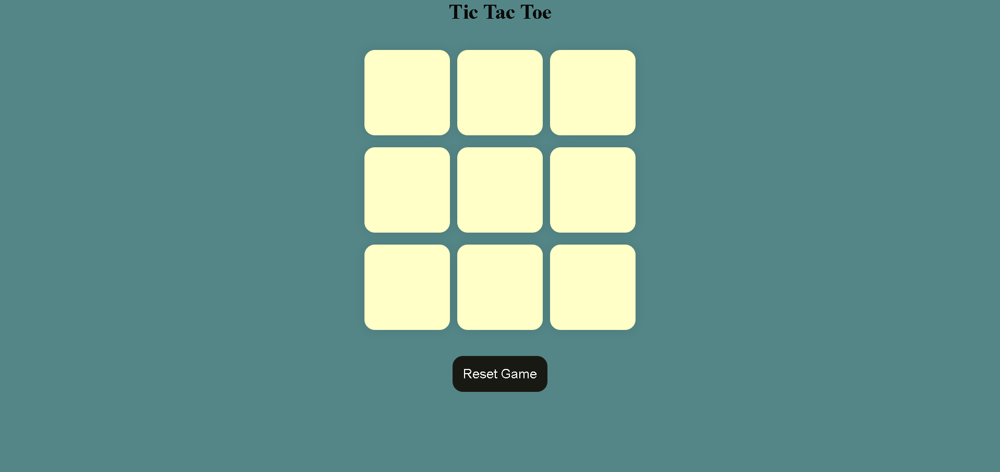

# Interactive Tic Tac Toe Game

A minimalistic yet fully interactive Tic Tac Toe game built with **HTML**, **CSS**, and **JavaScript**. This project offers a smooth and responsive gaming experience that adapts to any screen size, from mobile devices to desktops. Perfect for two players looking to have a quick, fun match!

## 🎮 Features
- **Turn-based Gameplay**: Switches automatically between "X" and "O" for each turn.
- **Winner Display**: Declares the winner and highlights the winning move.
- **Reset & New Game Options**: Restart the game board at any time.
- **Responsive Design**: Optimized layout for both desktop and mobile devices.

## 🚀 Technologies Used
- **HTML**: Structure of the game board and buttons.
- **CSS**: Custom styling and responsive layout.
- **JavaScript**: Game logic, turn management, and winner detection.

## 🛠️ Getting Started

1. **Clone the repository**:
    git clone https://github.com/itsalokbarnwal/interactive-tic-tac-toe-game.git
2. **Open `index.html`** in your browser to start playing!

## 🔄 Game Instructions

- **Objective**: Get three of your marks (either "X" or "O") in a row—vertically, horizontally, or diagonally.
- **Start Playing**: Click on any box to place your mark. The game will automatically alternate between "X" and "O."
- **Declare Winner**: The game will announce the winner once a winning sequence is achieved.
- **Reset Game**: Click the "Reset Game" button to start over at any time!
